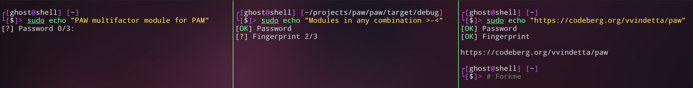

# PAW is modular multifactor module for PAM



**PAW is designed to avoid exposing the main system password when operating in an unsafe environment. Use it instead with a combination such as a secondary-password + fingerprint.** 
GrapheneOS-like authentication on your GNU/Linux system.

### Roadmap:
  - minimum number of successfully passed modules option

  Modules:
  - ~~Password~~
  - ~~Fingerprint~~
  - Faceid
  - NFC
  - Trusted Bluetooth/Wi-Fi networks

## How to install

### Install ```paw``` as a PAM module

1. Find the PAM modules directory on your system. Common paths:
   - `/usr/lib64/security` (Fedora-based distros)
   - `/usr/lib/security` (many Debian/Ubuntu-based distros)

2. Install `pam_paw.so` into that directory:

```bash
sudo install -m 0644 -o root -g root pam_paw.so /usr/lib64/security/pam_paw.so
```

### Install ```paw``` submodules

1. Create the ```paw``` directory inside the PAM security directory:

```bash
sudo mkdir /lib64/security/paw
```

3. Place ```paw``` modules in it:

```
sudo install -m 0644 -o root -g root paw_fingerprint.so /usr/lib64/security/paw_fingerprint.so

sudo install -m 0644 -o root -g root paw_password.so /usr/lib64/security/paw_password.so   
```
### Config

Create ```/etc/paw.conf```
```bash
sudo $EDITOR /etc/paw.conf
```

Format (one module per line):
```
path_to_paw_module attemps_number
```

Default attempts_number is 3 if omitted.
Order in the config affects the execution sequence.

#### Config example: 
```
/lib64/security/paw/paw_password.so
/lib64/security/paw/paw_fingerprint.so 5
```

### Edit PAM Configuration

To enable ```paw``` in a real PAM service, edit the corresponding file in `/etc/pam.d/`.

#### Example for `sudo`:

Add this line to `/etc/pam.d/sudo`:

```text
auth    sufficient    pam_paw.so
````

#### PAM has control flags for every module:

**requisite**
* Like `required`, but if it fails: stop immediately and return failure.
* If it succeeds: continues.

**required**
* If it fails: authentication will fail, but PAM continues running the rest of the stack.
* If it succeeds: continues.
* Final result: any `required` failure makes the whole stack fail.

**sufficient**
* If it succeeds: stop immediately and return success (if no prior `required`/`requisite` failed).
* If it fails: ignore the failure and continue.

**optional**
* Success/failure usually does not affect the result unless it is the only module in that stack.

---

## Testing

1. Install ```pamtester``` via your system package manager

2. Create and edit ```/etc/pam.d/paw_testing```:
```
auth    required    pam_paw.so
account required    pam_permit.so
```

3. Run

```pamtester paw_testing $USER authenticate```

## Build

```git clone https://codeberg.org/vvindetta/paw.git && cd paw```

```cargo build```

The build will be available inside ```paw/target/debug```.

#### Main PAM module (controls submodules):

```libhost.so``` -> ```pam_paw.so```

#### Submodules:

```libpaw_fingerprint.so``` -> ```paw_fingerprint.so```

```libpaw_password.so``` -> ```paw_password.so```
